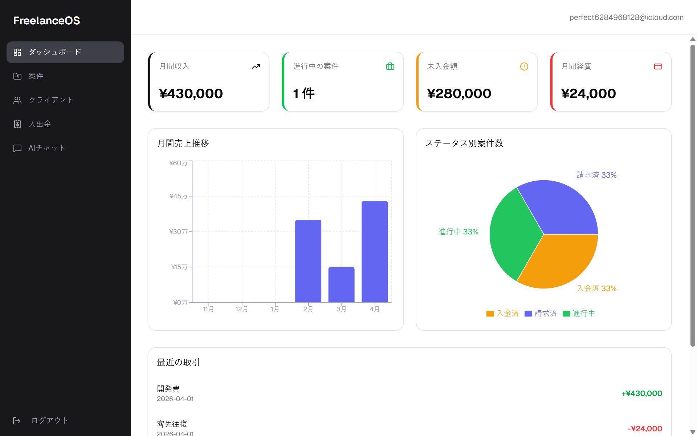

# FreelanceOS

A freelance business management web app powered by AI — manage projects, clients, and finances, and get instant insights from an AI assistant that knows your data.




## Features

- **Dashboard** — KPI cards (monthly income, active projects, unpaid total, monthly expenses) with bar and pie charts
- **Project management** — Create, edit, and delete projects with status tracking (estimate → in progress → completed → invoiced → paid)
- **Client management** — Manage clients with company info and project associations
- **Income & expense tracking** — Log transactions linked to projects, filter by type and month
- **AI assistant** — Chat with Claude AI about your projects and finances; the AI has full context of your data
- **Authentication** — Email/password auth with per-user data isolation via Supabase RLS

## Tech Stack

| Layer | Technology |
|---|---|
| Frontend | React 18 + JavaScript (JSX) |
| Build | Vite |
| Styling | Tailwind CSS v4 |
| UI Components | shadcn/ui |
| Database & Auth | Supabase (PostgreSQL + Auth + RLS) |
| AI Proxy | Vercel Serverless Functions (Node.js) |
| AI Model | Anthropic Claude API |
| Charts | Recharts |
| Forms | React Hook Form + Zod |
| Deploy | Vercel |
| Testing | Vitest + Playwright |
| CI | GitHub Actions |

## Architecture

```
Browser (React + Vite)
    │
    ├── Supabase (PostgreSQL + Auth)
    │     └── Tables: projects, clients, transactions, chat_history
    │         RLS: each user sees only their own data
    │
    └── Vercel Serverless Function (/api/chat)
          └── Fetches user data from Supabase
              └── Calls Anthropic Claude API with data context
```

## Local Setup

```bash
# 1. Clone
git clone https://github.com/rasokiwayami/freelance-os.git
cd freelance-os

# 2. Install dependencies
npm install

# 3. Create .env.local
cp .env.example .env.local
# Fill in your Supabase and Anthropic credentials

# 4. Run (use vercel dev to enable /api routes locally)
npm install -g vercel
vercel dev
```

**.env.local required variables:**
```
VITE_SUPABASE_URL=https://your-project.supabase.co
VITE_SUPABASE_ANON_KEY=your-anon-key
ANTHROPIC_API_KEY=sk-ant-...
SUPABASE_URL=https://your-project.supabase.co
SUPABASE_SERVICE_ROLE_KEY=your-service-role-key
```

## Running Tests

```bash
# Unit tests (Vitest)
npm run test

# E2E tests (Playwright) — requires a running dev server
npx playwright install chromium
npm run test:e2e
```

## Roadmap

- [ ] Function Calling — let the AI create projects and log transactions directly from chat
- [ ] Email notifications — invoice reminders via Resend
- [ ] PDF invoice generation
- [ ] Multi-currency support

## License

MIT
